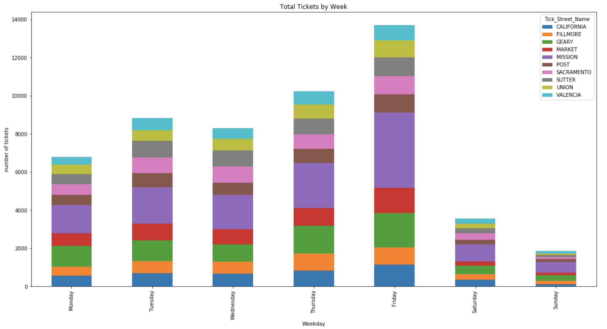
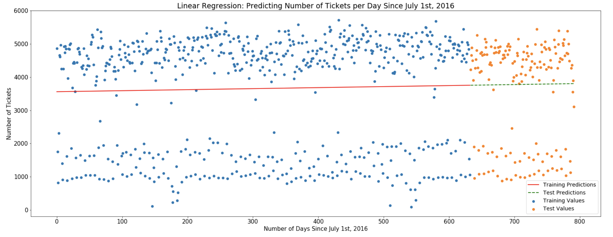
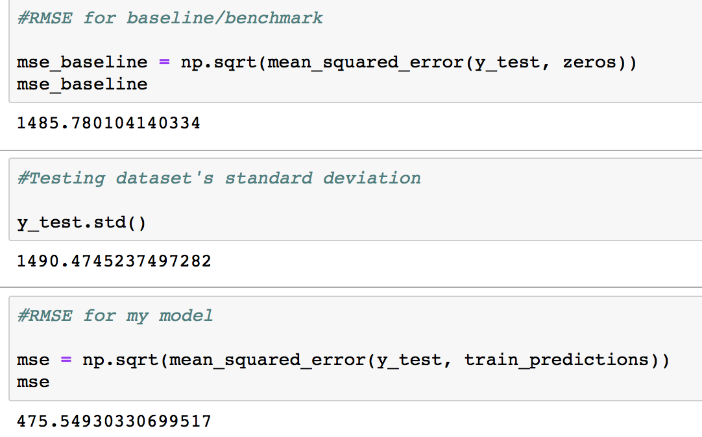

# San Francisco Parking Ticket Model

    
 

 
## Motivation
- The dataset used in this project included number of street parking ticket in San Francisco with spcific Date, Time, Year, and Street Names in San Francisco. The dataset obstained by a public request from SFMTA. 
- Street parking citation in San Francisco can makes a huge portion of government income. By knowing the estimation of parking ticket received next week, months, or year aids government on planning its budget accordingly. 
- I utilized this dataset to do data mining, to find the variation trend of highest number of parking ticket citation in San Francisco, and the factors associated with it. 

## Data
Data Collection:
- Parking ticket data was collected from requesting a public request from SFMTA, and they emailed me past two years of parking ticket data

Data cleaning:
- Scraping the ticket_issue_date feature into date_time stamp format
- Aggregate it into yearly, monthly, weekly and daily parking ticket
- Removed duplicates and NaN's, but there're None
- Explore the variance with number of parking ticket

## Learning methods for regression
      1. LSTM(time series) 
      2. Linear Regression 
      
- **What's LSTM?** 
Long short-term memory (LSTM) is a special kind of recurrent neural network (RNN) architecture (Hochreiter *et al*) used in the field of deep learning, which is able to remembering information for long periods of time. In Natural language processing (NLP), documents are fed into the model of LSTM one word by one word and the model will make the prediction with consideration of **word sequence**. A common LSTM unit is composed of a cell, an **input gate**, an **output gate** and a **forget gate**. The cell remembered values over arbitrary time intervals and the three gates regulated the flow of information in and out of the cell. Comparing to classical RNN, LSTM is capable of handling "long-term dependencies" **VERY WELL**.
  

  An unrolled recurrent neural network

 

   

 

 

  An illustration of the LSTM cells

   

## Exploratory data analysis
First I did some exploratory analysis just to look for some interesting takeaways in the data, as well as ensure the data was processed properly and no major holes existed. There are quite a few graphs generated in the notebooks, so I placed them in a Plots folder.

- The graph below shows chart of ticket rate by day of week. Seems like most people get caught off on the weekday, especially Friday.

   

- The graph below shows a huge gap between upper and lower distribution due to weekend and weekday success rate, so I decided to separate the data into two distributions: weekday and weekend to see if there's a linear relationship between each features.

   

- The graph below shows a weekend success rate - a lower distribution of the Linear Regression Model. The regression line fits well with this distribution

   

- The graph below shows a weekday success rate - a upper distibution of the Linear Regression Model. Weekday tend to have higher success rate, and thus more parking ticket. 

   

## Modeling with weekday success rate
### Linear Regression Model
Feature Enginneering:
- Tested different features to include in the model, most of the features didn't contribute
    - Benchmark RMSE = 355.79
    - Model RMSE = 359.09
  
Optimal:
- The weekday dataset was trained using Linear regresssion, and got a RMSE of my model 475.54 compare to RMSE of benchmark 1485.78 within the standard devision of y_test 1490.47. My model outperform the baseline model, which means my model is better at predicting future values compare to no model at all.

   

- The dataset is large and modeling could be computationally expensive. So Amazon Web Services (AWS) was applied to achieve a more efficient processing (m5.4xlarge).

### LSTM(time series) Model
- Utilized entire data set (number of parking tickets from past two years since 2016) splited into training and test dataset. Used training set to fit the LSTM model, and used test set to predict next day’s total number of parking ticket in San Francisco. 
- Used Epoches, Batch_size, Window_size, and Verbose as hyper-parameters
- Optimized minimum RMSE (Root Mean Square Error) 

   

## Future Work
Enhance model and model performance:
- Add more features into weekday and weekend success rate distribution
- Adjust the hyper-parameters in LSTM model to get a better result
- Predict other features such as street name, issue_time et. cetera
Interface:
- Create a user interface
- Add more data, maybe last four years data

## About Me
I'm Angel, a data scientist and an accountant. I love technology, mathematics, and using data to help businesses.
For any questions/comments you can contact me via LinkedIn [Angel-LinkedIn](www.linkedin.com/in/angellei)
